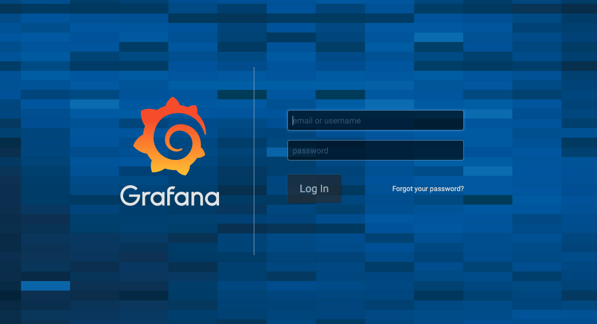
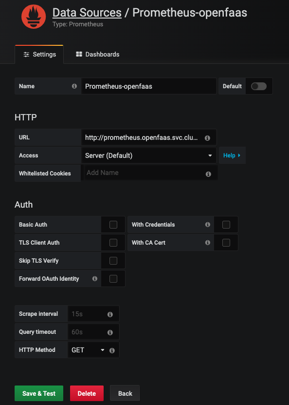
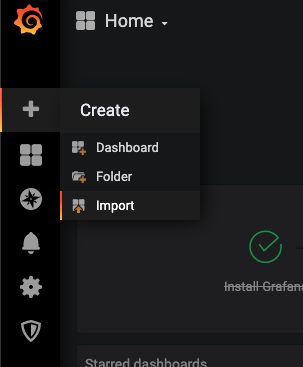
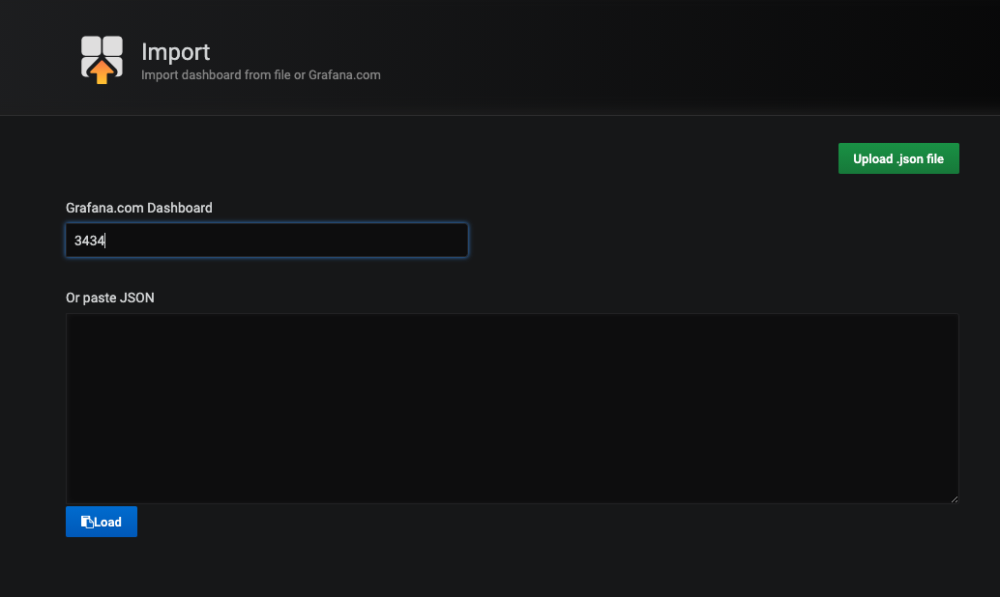
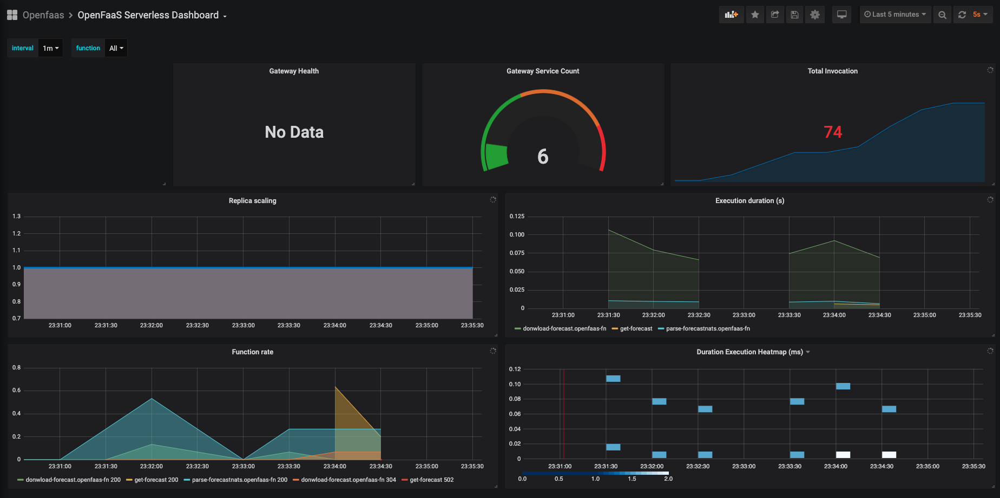

# OpenFaas


En esta sección instalaremos y probaremos OpenFaas y su cli. También veremos algunos ejemplos de funciones y como los integramos con otros de los servicios Serverless

- [Documentación oficial](https://www.openfaas.com/)

## Instalación
- [Instalación de OpenFaaS](install.md)

## Cli
- [Instalación de faas-cli](https://docs.openfaas.com/cli/install/)
- [Docs](https://blog.alexellis.io/quickstart-openfaas-cli/)
- [GitHub](https://github.com/openfaas/faas-cli)

Para la configuración de faas-cli usaremos el servicio gateway-external que vimos en la instalación y el pasword que generamos, que también podemos recuperar con el siguiente comando.

```bash
kubectl get secret basic-auth -n openfaas -o 'jsonpath={.data.basic-auth-password}'| base64 -d
```

## Desarrollo

El desarrollo de las funciones en OpenFaas se basan en templates. Para comenzar debemos ejecutar la siguiente instrucción para crear una nueva función:
```bash
faas new --lang node12 hello-world
```
Donde `--lang node12` es la plantilla que queremos usar y `hello-world` es el nombre de la función que queremos crear.

Esta instrucción nos genera el descriptor de la función [`hello-world.yml`](examples/hello-world.yml) 

```yml
version: 1.0
provider:
  name: openfaas
functions:
  hello-world:
    lang: node12
    handler: ./hello-world
    image: oillescas/hello-world:latest
```

Y una carpeta con el archivo `handler.js` y el archivo `package.json`, este es el lugar donde desarrollaremos nuestra función.

En el archivo `handler.js` debemos exportar la función que queremos ejecutar
```javascript
'use strict'

module.exports = async (event, context) => {
  const result = {
    'status': 'Received input: ' + JSON.stringify(event.body)
  }

  return context
    .status(200)
    .succeed(result)
}
```

esta función va a recibir como parámetros, un evento y un contento. 
- En el evento vamos a encontrar los datos de la llamada a la función, el body, las cabeceras, el método, el query path, y el path.
- Mientras que en el contexto vamos a encontrar los métodos para devolver la respuesta, status, headers, succeed y fail.

Podemos encontrar plantillas para gran cantidad de lenguajes de programación y versiones de los mismos. 

Una vez desarrollada podemos desplegarla con 
```bash
faas-cli up -f hello-world.yml
```
 - esto nos construirá una imagen docker
    ```bash
    faas-cli build -f hello-world.yml
    ```
 - nos subirá la imagen al registro de docker
    ```bash
    faas-cli push -f hello-world.yml
    ```
- y desplegará la función en nuestro cluster Kubernetes
    ```bash
    faas-cli deploy -f hello-world.yml
    ```
En un solo comando, si queremos lanzar solo uno de esos pasos solo tenemos que lanzar los comandos anteriores.

Podemos consultar los logs de la ejecución de la función con el comando
```bash
faas-cli logs hello-world
```

Ademas podemos crear nuestras propias plantillas para añadir lenguajes o para abstraer partes comunes del desarrollo en varias faas. En este ejemplo hemos desarrollado 2 plantillas basadas en la plantilla original node12.

### Custom templates
#### node12-files
Esta plantilla ánade el plugin de files al servidor express que posee la plantilla oficial de node12, esto hace que se puedan recibir de una manera sencilla archivos via http.
#### node12-nats
Esta plantilla parsea la cabecera de manera manual para facilitar la lectura de una cola de mensajes Nats.

## Ejemplos
Todos los ejemplos se pueden desplegar con el comando deploy ya que todas las imágenes están publicadas en DockerHub
```bash
faas-cli deploy -f <name_of_faas.yaml>
```

Para modificar y probar las modificaciones debes estar autenticado en DockerHub y modificar el archivo .yml cambiando mi usuario de DokerHub (oillescas) por el tuyo.

También necesitas descargar los templates OpenFaas con los siguientes comandos.

```bash
faas template pull
faas template pull https://github.com/oillescas/openfaas_nodejs_templates
```
### Hello world
Ejemplo básico de función http en node 
[Examples/openfaas/hello-world](/Examples/openfaas/hello-world)

### REST api (mongo and -postgresql-)
En estos dos ejemplos hemos creado 2 ejemplos de conexión a base de datos en uno de ellos un crud contra mongo y en el otro una pequeña api para gestion de dispositivos.
- En el ejemplo con mongo es necesario tener desplegado el [operador de mongo](../../Databases/perconaMongodb/readme.md) y una base de datos mongo.
- Mientras que en el ejemplo de postgresql necesitaremos el [operador de postgresql](../../Databases/zalandoPostgresOperator/readme.md) y una base de datos

### Api minio 
En este ejemplo hemos expuesto la gestión de archivos de minio via un api REST hace uso la la template [node12-files](#node12-files) para poder recibir y enviar archivos a Minio.
Para poder ejecutarla necesitamos [instalar minio](../../GestionArchivos/install-minio.md) antes de desplegar la función.  

## Monitoring
Lan instalación de open faas deja instalado en en namespace openfaas un servicio de prometheus que monitoriza la instalación.
Y en microk8s en el Namespace monitoring tenemos un servicio de grafana, con los dashboard del propio k8s, y vamos a configurar un dashboard para openfaas.

Primeramente tenemos que acceder a grafana, podremos hacer un proxy al puerto, pero por comodidad vamos a exponer el servicio con un ingress.

```bash
kubectl apply -f ingress-grafana.yml
```

accedes al dominio de ingress <http://grafana.192.168.0.100.nip.io/> con usuario/password admin/admin después del primer login deberás cambiar el password.


Una vez logado añadimos el prometeus del namespace openfaas como data source.



Cuando ya tenemos este nuevo datasource importamos el siguiente dashboard de la web de grafana

<https://grafana.com/grafana/dashboards/3434>

- Paso 1
    
    
- Paso 2
    
- Paso 3
    

Y ya podemos nuestro dashboard.



## Links
- [Auto Scaling](https://docs.openfaas.com/architecture/autoscaling/)
- [Triggers](https://docs.openfaas.com/reference/triggers/)
- [Plonk stak](https://www.openfaas.com/blog/plonk-stack/)