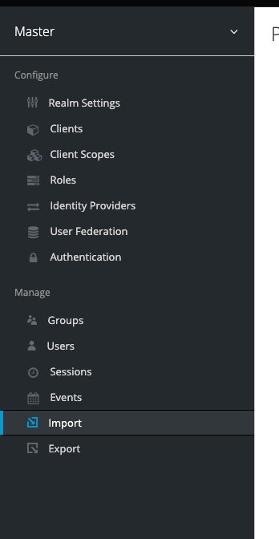

# Keycloack

## Install

- [Install keycloak](install.md)

## Importar realm

Para facilitar la prueba hemos configurado y exportado un "realm" y vamos a proceder a importalo

1. Login to the admin console
    Go to the Keycloak Admin Console and login with the username and password you created earlier.
    <https://keycloak.192.168.0.100.nip.io/>

1. Import realm-export.json

    

1. Regeneramos el secretskey
1. Actualizamos los despliegues con el nuevo secretkey
1. Creamos un usuario

## Ejemplos

### Secure Static website

- [Nginx ingress](simple-ingress/readme.md)

### Secure openfaas function

- [OpenFaaS](OpenFaaS/readme.md)

## Links

- [Keycloak in kubernetes](https://www.keycloak.org/getting-started/getting-started-kube)
- [Keycloak Kubernetes Operator](https://www.keycloak.org/getting-started/getting-started-operator-kubernetes)
