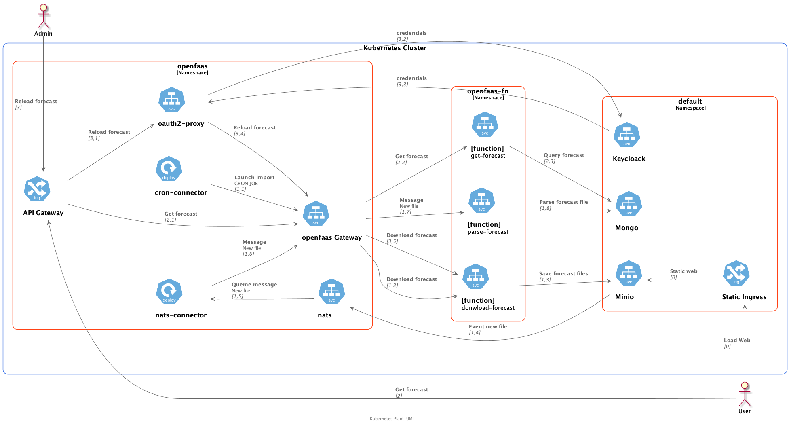
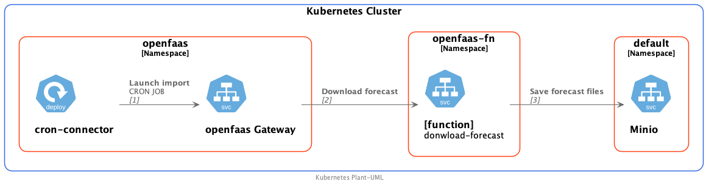
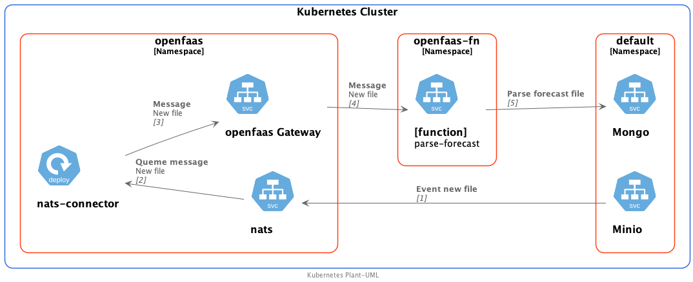
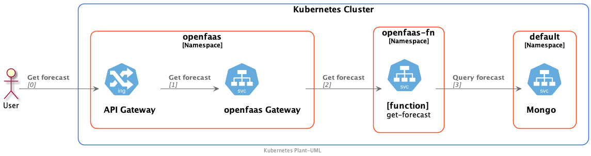
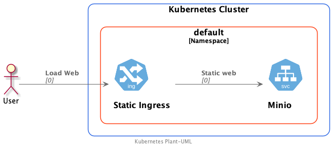

# Ejemplo de aplicación completa


[plant-uml](docs/uml/full-app.puml)

## Funciones

### download-forecast

Esta función descarga via http la prevision metorologica desde la web de Aemet y la guarda en un bucket de minio.

Se lanza automaticamente según la configuración del cron-connector



- [plant-uml](docs/uml/download-forecast.puml)
- [Código](functions/download-forecast)

### parse-forecas

Esta función revice un evento de minio via una cola nats cada ver que un nuevo fichero de prediccion meteorologica se guarda.

Cuando la función recibe el evento descarga el archivo desde minio, transforma la informacion y la guarda la la base de datos mongodb.



- [plant-uml](docs/uml/parse-forecast.puml)
- [Código](functions/parse-forecastnats)

### get-forecast

Esta funcion devuelve los datos de la predicción meteorologica para una localidad via http.



- [plant-uml](docs/uml/get-forecast.puml)
- [Código](functions/get-forecast)

## Sitio web estatico

Sirve la pagina web statica que hace uso de las funciones openfaas descritas anteriormente.


[plant-uml](docs/uml/static-site.puml)

## Como Instalar la aplicación

### Prerequisitos

- [Instalación Básica de MicroK8s](/Microk8s.md)
- [Instalación de OpenFaas](/1.faas/openFaas/install.md)
- [Instalación de minio y minio client](/2.GestionArchivos/minio/install.md)
- [Instalación del operador de mongo](/3.BasesDeDatos/perconaMongodb/install.md)

### Pasos para instalar la aplicación

- Creación y configuración de un bucket en minio.
  - [Instrucciones](config-minio.md)
- Configuración del cluster mongodb
  - [Instrucciones](config-mongo.md)
- Despliegue de las funciones openfaas
  
  ```bash
  cd functions
  faas deploy -f stack.yml 
  ```

- Despliegue de los componentes kubernetes

  ```sh
  kubectl apply -f kube/connector-dep.yaml
  kubectl apply -f kube/ingress.yaml
  ```
