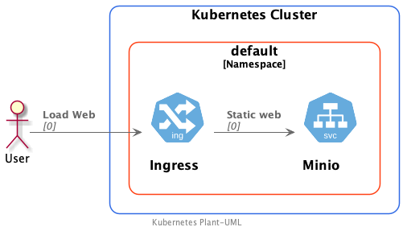

# Gestión de archivos

Al no usar servidores es necesario un servicio que se encargue de gestionar los archivos necesarios para una aplicación serverless. Como alternativa a este servicio vamos a instalar y probar Minio. 
- [Documentación Oficial](https://min.io/)

## Minio
- [Instalacion de Minio](install-minio.md)

## Ejemplos 
Dentro de los posibles usos que se dan normalmente al almacenamiento de ficheros, es el despliegue de las partes estáticas de los sitios web, en esta sección veremos un ejemplo de como desplegar uno. Además en la sección de funciones podremos ver como integrar una función OpenFaaS con el api de Minio.

### Despliegue de un sitio estático


1. Instalar minio client(mc) para el sistema operativo que necesites.
     - [Minio Client](https://github.com/minio/mc)

1. [Recuperamos las claves de acceso](install-minio.md#recuperando-las-keys-de-acceso)

1. Configurar mc para atacar a nuestro minio
    ```shell
    # mc config host add minio-tfm http://<VirtualMachine-IP>:<External-Port> YOURACCESSKEY YOURSECRETKEY S3v4
    mc config host add minio-tfm http://192.168.64.12:31131 YOURACCESSKEY YOURSECRETKEY
    ```

 1. Creamos y configuramos un bucket
    ```shell
    mc mb minio-tfm/static-site
    mc policy set download minio-tfm/static-site
    ```
 1. Subimos a minio los archivos estáticos
    ```shell
    mc mirror ./simple-app/dist minio-tfm/static-site
    ...d34bd3.js:  151.63 KiB / 151.63 KiB  ▓▓▓▓▓▓▓▓▓▓▓▓▓▓▓▓▓▓▓▓▓▓▓▓▓  1.24 MiB/s 0s
    ```

3. Desplegamos la configuración de ingress
    ```shell
    kubectl apply -f ingress.yaml
    ```

Podemos visitar el sitio en:
<https://miniostatic.192.168.0.100.nip.io/>


## Link
- [Minio Client Guide](https://github.com/minio/mc/blob/master/docs/minio-client-complete-guide.md)