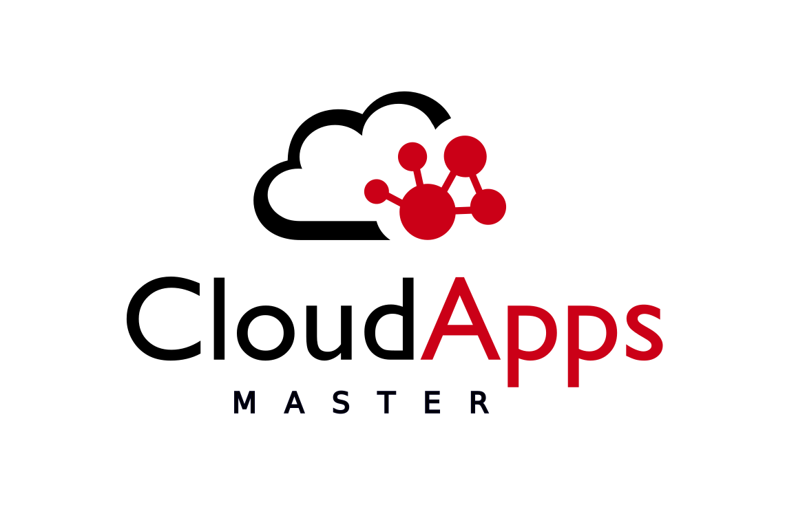

# Serverless-Kubernetes

Este repositorio guarda la documentación y pruebas realizadas para el TFM del
"[Máster Cloud Apps. Desarrollo y despliegue de aplicaciones en la nube](https://www.codeurjc.es/mastercloudapps/)" de la Universidad Rey Juan Carlos.

Este TFM consiste en el estudio de las alternativas en Kubernetes a los servicios Serverless
que ofrecen los proveedores de cloud como AWS, Azure o GCP.

## Servicios

1. [Funciones como servicio (Faas)](#funciones-como-servicio-faas)
1. [Gestión de archivos](#gestión-de-archivos)
1. [Bases de datos](#bases-de-datos)
1. [Colas de mensajería y gestión de eventos](#colas-de-mensajería-y-gestión-de-eventos)
1. [Gestión de usuarios](#gestión-de-usuarios)

### Funciones como servicio (Faas)

| AWS                                         | Azure                                                              | GCP                                                   |
|---------------------------------------------|--------------------------------------------------------------------|-------------------------------------------------------|
| [Lambda](https://aws.amazon.com/es/lambda/) | [Functions](https://azure.microsoft.com/es-es/services/functions/) | [Cloud Functions](https://cloud.google.com/functions) |

 En esta sección vamos a instalar y probar varias opciones de faas basadas en Kubernetes. Para intentar sustituir las funciones de proveedor como AWS Lambda o Azure Function.

- [X] [Knative](/1.faas/knative/readme.md)
- [X] [OpenFaaS](/1.faas/OpenFaaS/readme.md)
<!-- - [ ] [Openwisk](/1.faas/openwisk/readme.md) -->

### Gestión de archivos

| AWS                                 | Azure                                                                     | GCP                                                         |
|-------------------------------------|---------------------------------------------------------------------------|-------------------------------------------------------------|
| [s3](https://aws.amazon.com/es/s3/) | [Blob Storage](https://azure.microsoft.com/es-es/services/storage/blobs/) | [Cloud Storage](https://cloud.google.com/storage?hl=es-419) |

Otro servicio que ofrecen los proveedores de cloud son la gestión y almacenamiento de archivos en este caso vamos a instalar y probar minio,
que implementa un api compatible con AWS S3 y que posee un operador de Kubernetes que nos permite el autoescalado.

- [X] [Minio](/2.GestionArchivos/minio/readme.md)

### Bases de datos

| AWS                                             | Azure                                                              | GCP                                               |
|-------------------------------------------------|--------------------------------------------------------------------|---------------------------------------------------|
| [dynamodb](https://aws.amazon.com/es/dynamodb/) | [Cosmos DB](https://azure.microsoft.com/es-es/services/cosmos-db/) | [Cloud Spanner](https://cloud.google.com/spanner) |

Las alternativas a las bases de datos administradas por los proveedores de cloud serian los Operadores Kubernetes de bases de datos,
en este trabajo vamos a instalar y probar 2 de ellos, el operador de MongoDB de Percona y el operador de PostgreSQL de Zalando.

- [X] [Mongodb operator](/3.BasesDeDatos/perconaMongodb/readme.md)
- [X] [Postgresql operator](/3.BasesDeDatos/zalandoPostgresOperator/readme.md)

### Colas de mensajería y gestión de eventos

| AWS                                                    | Azure                                                                       | GCP                                                   |
|--------------------------------------------------------|-----------------------------------------------------------------------------|-------------------------------------------------------|
| [SQS](https://aws.amazon.com/es/sqs/)                  | [Service Bus](https://azure.microsoft.com/es-es/services/service-bus/)      | [Cloud Pub/Sub](https://cloud.google.com/pubsub/docs) |
| [SNS](https://aws.amazon.com/es/sns/)                  | [Queue Storage](https://azure.microsoft.com/es-es/services/storage/queues/) |                                                       |
| [Event Bridge](https://aws.amazon.com/es/eventbridge/) | [Event Grid](https://azure.microsoft.com/es-es/services/event-grid/)        |                                                       |

Hasta ahora las pruebas que hemos hecho han lanzado las funciones ante una petición http
en esta sección vamos a comprobar com podemos ejecutar estas funciones por otros mecanismos.
Concretamente probaremos los sistemas de colas integradas dentro de Knative y OpenFaaS y también
instalaremos y probaremos Argo Events, un orquestador de eventos que nos permite ejecutar entre otras cosas funciones OpenFaaS.

- [X] [Knative](/4.ColasEventos/Knative/events.md)
- [X] [OpenFaaS](/4.ColasEventos/OpenFaaS/events.md)
- [X] [Argo Events](/4.ColasEventos/ArgoEvents/readme.md)

### Gestión de usuarios

| AWS                                           | Azure                                                                                                        | GCP                                       |
|-----------------------------------------------|--------------------------------------------------------------------------------------------------------------|-------------------------------------------|
| [cognito](https://aws.amazon.com/es/cognito/) | [Active Directory B2C](https://azure.microsoft.com/es-es/services/active-directory/external-identities/b2c/) | [Cloud IAM](https://cloud.google.com/iam) |

En esta sección vamos a instalar Keycloak para la gestión de usuarios dentro del ecosistema kubernetes, como alternativa a los sistemas de identidad y acceso de los proveedores de cloud,
además vamos a implementar varios ejemplos de cómo integrarlos en las funciones OpenFaaS que hemos desarrollado anteriormente.

- [X] [Keycloak](/5.Usuarios/Keycloak/readme.md)

## Aplicación de Ejemplo

Para terminar hemos desarrollado una pequeña aplicación de ejemplo donde ponemos en común alguno de los servicios que hemos probado anteriormente.

- [X] [App](/6.app/readme.md)

## Próximos pasos

- Otros operadores de bases de datos
  - [MongoDB Enterprise Kubernetes Operator](https://github.com/mongodb/mongodb-enterprise-kubernetes)
  - [Scylla Alternator](https://docs.scylladb.com/using-scylla/alternator/)
  - [Otros](https://operatorhub.io/?category=Database)
- Herramientas para integrar funciones en workflows
  - [Argo Workflows](https://argoproj.github.io/projects/argo)
  - [Faas Flows](https://github.com/s8sg/faas-flow)
- Probar herramientas de CI/CD para el despliegue de funciones
  - [OpenFaaS cloud](https://github.com/openfaas/openfaas-cloud)
  - [ci/cd for knative with concourse](https://medium.com/aptomi/ci-cd-for-knative-serverless-apps-on-kubernetes-with-concourse-54bafef51767)
- Otras herramientas
  - [OpenFaaS Ingress Operator](https://github.com/openfaas/ingress-operator)

<!-- TODO remplazar los png de los UML -->

<https://github.com/dcasati/kubernetes-PlantUML>