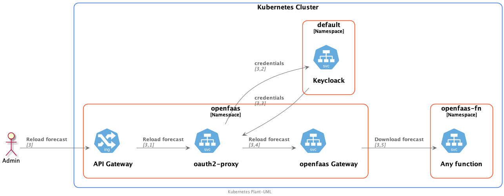

# Secure openFaas function

## Links

- [Adding authentication to your Kubernetes Web applications with Keycloak](https://www.openshift.com/blog/adding-authentication-to-your-kubernetes-web-applications-with-keycloak)