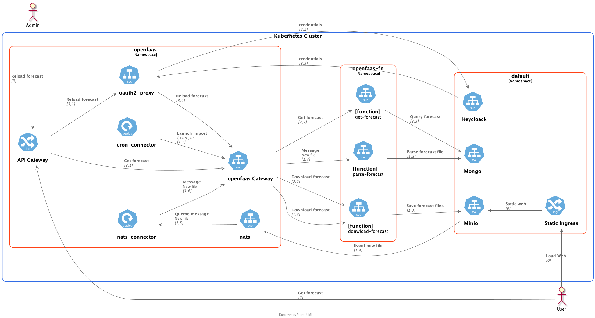
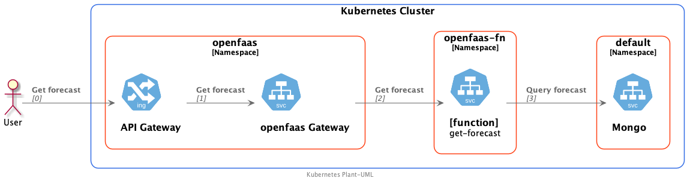
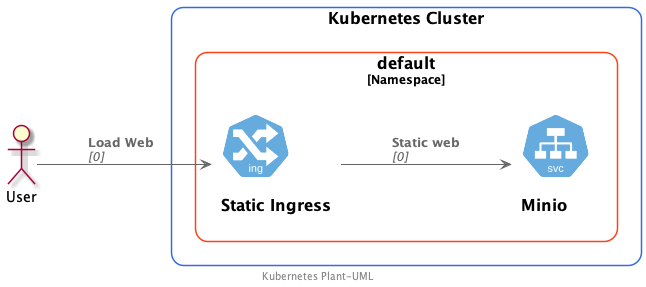

# Example app


[plant-uml](docs/uml/full-app.puml)

## Functions

### donwload-forecast

This function downloads the weather forecast from Aemet's servers and saves it to the minio server. 
It is automatically launched according to the cron-connector configuration


[plant-uml](docs/uml/download-forecast.puml)

### parse-forecas

This function receives a message from minio via a nats topic each time a new weather forecast file is saved.

When the function receives the message it downloads the file from minio, transforms the data, and saves it in the mongodb database.


[plant-uml](docs/uml/parse-forecast.puml)


### get-forecast
This function returns the query of all weather forecasts via http


[plant-uml](docs/uml/get-forecast.puml)

## Static site 
Serve static html

[plant-uml](docs/uml/static-site.puml)


## How to install
- Prerequisites
    - [Basic installation of microk8s](../Microk8s.md)
    - [install minio & minio client](../StaticPageDeployment/install-minio.md)
    - [Install postgresql operator](../Databases/zalandoPostgresOperator/install.md)

- deploy and configure minio
    - [instructions](docs/config-minio.md)
- deploy and configure mongodb
    - [instructions](docs/config-mongo.md)
- deploy openfaas stacks
  ```bash
  cd functions
  faas deploy -f stack.yml 
  ```